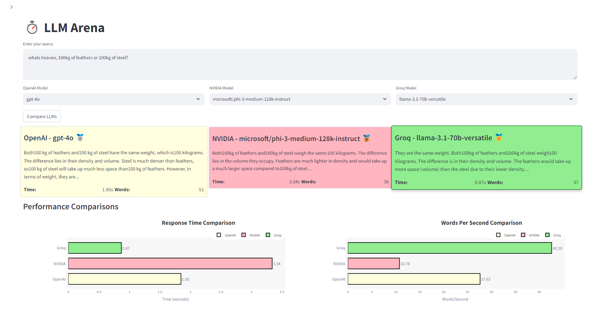
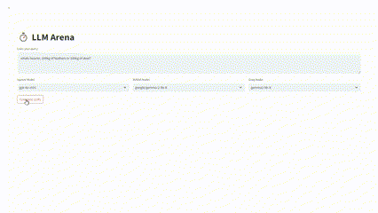

# 🤖 LLM Arena - Battle of the Language Models



Welcome to **LLM Arena**! This is where the heavyweights of language models go head-to-head: OpenAI, NVIDIA, and Groq. Our goal? To find out which model and provider is the fastest and most efficient in terms of both speed and the number of words generated.

  

## Why LLM Arena? 🤔

This is a solution to question I had while implementing an agentic solution, I was thinking all the possible ways to make it run faster. I came up with this app just to illustrate the concept of how usefull coluld it be to choose the right models and providers.



## 🚀 Features

- **Compare** the speed and word count across OpenAI, NVIDIA, and Groq language models.
- **Streaming** responses in real-time using an **async** backend for ultimate performance.

## 🎯Upcoming Features

- **📊 Tokens & Cost Metrics**: Compare models not just by speed, but by how much they cost per token too! 💸

## Tech Stack 🛠️

- **Backend**: Python + FastAPI + Langchain

  
  

  The backend is powered by FastAPI and is fully asynchronous, ensuring fast response times and real-time streaming for all the models.

  I'm using LangChain for the LLM's generating responses and streaming.
  LangChain allows for more flexible and structured interactions with LLM's.

  The backend services for OpenAI, NVIDIA, and Groq are implemented in the services folder, and responses are streamed asynchronously using FastAPI’s StreamingResponse.

- **Frontend**: Streamlit for easy UI and visuals

  

- **Containerization**: Docker for hassle-free setup and deployment

  

## Requirements 📦

- Docker & Docker Compose installed
- API keys for **OpenAI**, **Nvidia**, and **Groq**

## Installation 🔧

1. Clone the repo:

   ```bash
   git clone https://github.com/your-username/llm-arena.git
   cd llm-arena
   ```

2. Create the `secrets.toml` file inside `frontend/.streamlit` directory:

   ```bash
   touch frontend/.streamlit/secrets.toml
   ```

3. Add your API keys to the `secrets.toml` file (replace with your own keys):

   ```toml
   # Streamlit secrets file
   BACKEND_URL = "http://backend:8000"

   # API Keys (these will be populated from environment variables in production)
   OPENAI_API_KEY = "your_openai_api_key"
   NVIDIA_API_KEY = "your_nvidia_api_key"
   GROQ_API_KEY = "your_groq_api_key"
   ```

4. Build the Docker containers:

   ```bash
   docker-compose build
   ```

5. Start the app:

   ```bash
   docker-compose up
   ```

6. Visit `http://localhost:8501` in your browser to start comparing LLMs! 🖥️

## How to Use 🕹️

1. Choose the LLM model you want to compare.
2. LLM Arena will show you metrics like response time, word count and full response bellow.
3. Use these insights to decide which model is the best fit for your project!

## Contributing 🛠️

Want to help make LLM Arena even better? Contributions are welcome!

1. Fork the repo
2. Create a new branch: `git checkout -b feature/awesome-feature`
3. Make your changes and commit: `git commit -m 'Add some awesome feature'`
4. Push to the branch: `git push origin feature/awesome-feature`
5. Open a pull request 🚀

We can't wait to see what you'll bring to the project! 🙌

## Connect with Me 💬

If you have any questions, feel free to reach out:

- **[Twitter](https://x.com/Farmacod)**
- **[LinkedIn](https://www.linkedin.com/in/gutierrezfrancois/)**
- **[GitHub](https://github.com/DrZuzzjen)**

---

Happy coding and may the best LLM win! ⚡
"""
